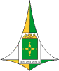

 | CÂMARA LEGISLATIVA DO DISTRITO FEDERAL | 
--- | :---: | ---
| **COORDENADORIA DE MODERNIZAÇÃO E INFORMÁTICA - CMI** | 
| **OFICINA ASI/LABHINOVA** | 
| **ANÁLISE EXPLORATÓRIA DE DADOS ABERTOS USANDO PYTHON** | 
|| 
| **ÍNDICE** | 
|| 
| **[Apresentação](apresentacao.ipynb)** | 
| **[Acessando Dados Abertos por meio de uma API](etapas/json/json.ipynb)** | 
| **[Explorando Dados Abertos de Arquivos CSV](etapas/csv/csv.ipynb)** | 
| **[Plotando e Visualizando Gráficos Usando Bokeh](etapas/bokeh/bokeh.ipynb)** | 
